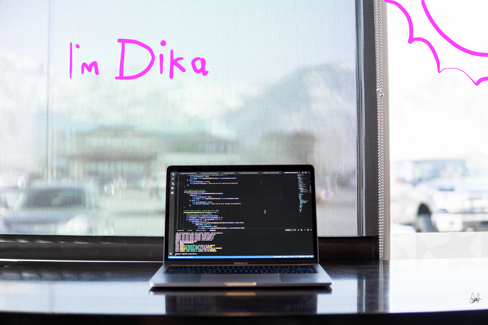

<br/> <br/>

# Hello internet I'am Dika

## I'm QA Engineer
#### Here are some ideas to get you started:

- ⚡ I’m currently working on [Tanifund][tanifund] as QA Engineer

what's i do?
```ruby
🍭 Build API Automation Testing using (Ruby, Httparty, Cucumber, Docker, Jenkins)
🍭 Create technical documentation for other QA Engineer
```
- ⚡ I’m currently learning [IDS Digital Collage][ids] - Software Engineer

## How to reach me:
[][linkedin] 
[][instagram]

<br/><br/>

## Language and Tools:
[][vscode]
[][java]
[][testng]
[][restassured]
[][selenium]
[][ruby]
[][cucumber]
[][httparty]
[][appium]
[][allure]
[][docker]
[][jenkins]
[][git] 


<br/><br/>
<br/><br/>


## Experience
- ⚡ QA Engineer - RCTI+ 

what's i do?
```ruby
🍭 Build automation testing Api & Web UI using [Java, Selenium, RestAssured, TestNG, Allure Report, Docker, Jenkins])
```
- ⚡ Eannovate QA Engineer (Magang)


[tanifund]: https://www.tanifund.com
[linkedin]: https://www.linkedin.com/in/fransiskus-andika-setiawan
[instagram]: https://www.instagram.com/dikako.ko
[vscode]: https://code.visualstudio.com/
[git]: https://git-scm.com/
[github]: https://github.com/dikako
[ruby]: https://www.ruby-lang.org/
[appium]: http://appium.io/
[selenium]: https://www.selenium.dev/
[cucumber]: https://cucumber.io/
[java]: https://www.java.com/
[testng]: https://testng.org/doc
[restassured]: https://rest-assured.io/
[httparty]: https://github.com/jnunemaker/httparty
[allure]: http://allure.qatools.ru/
[jenkins]: https://www.jenkins.io/
[docker]: https://www.docker.com/
[ids]: https://ids.ac.id/

