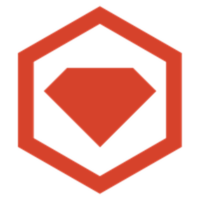

<br/> 

# Hello internet I'm Dika🤘

## I'm QA Engineer
#### Here is About me:

- ⚡ I’m currently working on [bibit][Bibit] & [stockbit][Stockbit] as QA Engineer
```ruby
STOCKBIT
- Create Automation for iOS Apps using Cucumber Java, XCUITest, Appium, Gitlab pipeline and integrate with Browserstack
- Maintaining Automation iOS Apps
- Maintaining pipeline Automation iOS Apps
- Improve Automation framework for iOS automation testing running on Browserstack
```

- 🎯 I’m currently learning [IDS Digital Collage][ids] - Software Engineer (Bachelor Degree)

## How to reach me:
[][linkedin] 
[][instagram]
[][instagram]

<br/><br/>

## Language and Tools:
[][vscode]
[][java]
[][testng]
[][restassured]
[][selenium]
[][ruby]
[][cucumber]
[][httparty]
[][appium]
[][allure]
[][docker]
[][jenkins]
[][git] 
[][xcuitest]
[][salad]
[][browserstack]
[][intellij]
[][postman]
[][xray]
[][gitlab]
[][k6]
<br/><br/>


## Experience
- ☑️ QA Engineer - [bukalapak][Bukalapak] as Test Engineer
```ruby
- Squad Investment
-- Create Automation for:
---- iOS(XCUITest, Cucumber, Java, Appium, Xray)
---- Android(Espresso, Cucumber, Java, Appium, Xray)
---- Web(Cucumber, Ruby, capybara, Xray)
---- Api(Cucumber Ruby, httparty, Xray)
-- Manual Testing for new feature:
---- iOS & Android Bukalapak Marketplace (Bukareksa & BukaEmas)
---- iOS & Android (BMoney)
-- Regression Testing (Automation & Manual)
-- Mentoring new member TE (Test Engineer)
-- Monitoring SmokeTest
-- Monitoring automation pipeline [Gitlab Pipeline for api & web] and [Jenkins for iOS & Android]
```

- ☑️ QA Engineer - [Tanifund][tanifund] 

what's i do?
```ruby
🍭 Build API Automation Testing using (Ruby, Httparty, Cucumber, Docker, Jenkins)
🍭 Create technical documentation for other QA Engineer
```

- ☑️ QA Engineer - [rctiplus][rctiplus]

what's i do?
```ruby
🍭 Build automation testing Api & Web UI using [Java, Selenium, RestAssured, TestNG, Allure Report, Docker, Jenkins]
```
- ☑️ [eannovate][Eannovate] - QA Engineer (Magang)


[tanifund]: https://www.tanifund.com
[linkedin]: https://www.linkedin.com/in/fransiskus-andika-setiawan
[instagram]: https://www.instagram.com/dikako.ko
[vscode]: https://code.visualstudio.com/
[git]: https://git-scm.com/
[github]: https://github.com/dikako
[ruby]: https://www.ruby-lang.org/
[appium]: http://appium.io/
[selenium]: https://www.selenium.dev/
[cucumber]: https://cucumber.io/
[java]: https://www.java.com/
[testng]: https://testng.org/doc
[restassured]: https://rest-assured.io/
[httparty]: https://github.com/jnunemaker/httparty
[allure]: http://allure.qatools.ru/
[jenkins]: https://www.jenkins.io/
[docker]: https://www.docker.com/
[ids]: https://ids.ac.id/
[stackoverflow]: https://stackoverflow.com/questions/64702927/how-can-i-extract-data-from-json-array-to-use-in-subsequent-rest-assure-api-requ/64735303#64735303
[xcuitest]: https://appium.io/docs/en/drivers/ios-xcuitest/
[salad]: https://github.com/salad/salad
[bukalapak]: https://www.bukalapak.com/
[bibit]: https://bibit.id/
[stockbit]: https://stockbit.com/
[rctiplus]: https://www.rctiplus.com/
[eannovate]: https://www.eannovate.com/
[browserstack]: https://www.browserstack.com
[intellij]: https://www.jetbrains.com/idea/
[postman]: https://www.postman.com/
[xray]: https://www.getxray.app/
[gitlab]: https://about.gitlab.com/
[k6]: https://k6.io/
